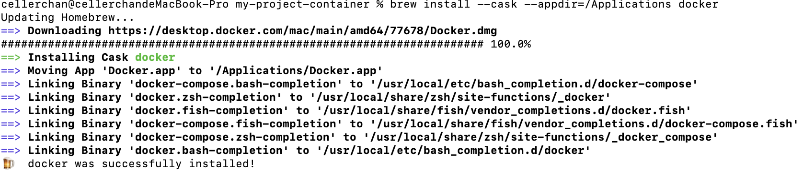
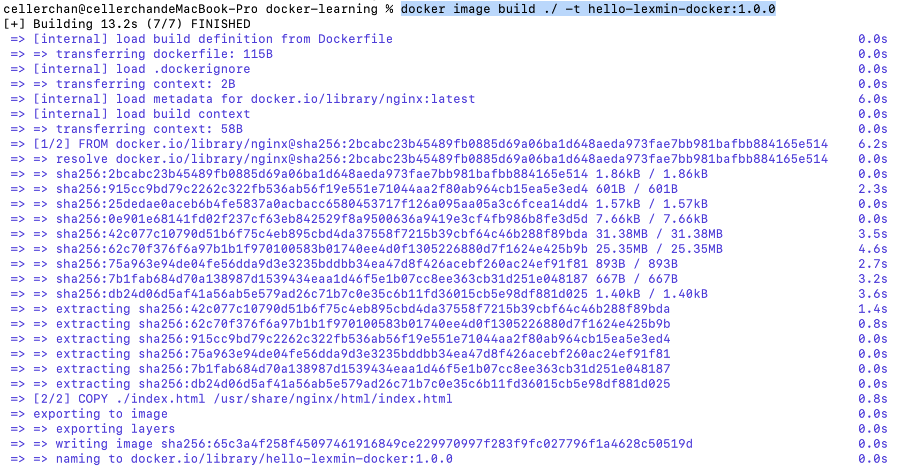
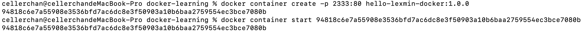

# docker 部署项目

步骤：

书写dockerfile => 基于 dockerfile 构建镜像 => 基于镜像创建容器 => 启动容器


## 安装 docker

```bash
brew install --cask --appdir=/Applications docker
```



## 书写 dockerfile

### 创建项目

首先我们在本地新建一个文件夹 docker-learning，然后新建 index.html 和 dockerfile 两个文件：

```html
<!-->index.html<-->
<h1>Hello docker</h1>
```

```dockerfile
# dockerfile
FROM nginx

COPY ./index.html /usr/share/nginx/html/index.html

EXPOSE 80
```

## 构建镜像

```shell
docker image build ./ -t hello-lexmin-docker:1.0.0
```

以上命令表示基于当前目录构建一个镜像，镜像名称为 hello-lexmin-docker, 镜像版本号为 1.0.0



### 创建并启动容器

```shell
# 创建容器
docker container create -p 2333:80 hello-lexmin-docker:1.0.0

# 启动容器
docker container start 94818c6e7a55908e3536bfd7ac6dc8e3f50903a10b6baa2759554ec3bce7080b
```



以上的 create 命令表示基于 hello-lexmin-docker 镜像的1.0.0 版本创建一个容器，并将容器中的80端口绑定在宿主机的2333端口。执行 create 命令会输出一个容器 ID，在启动容器时需要指定此 ID。

执行以上命令后，访问本地的 127.0.0.1:2333 即可访问到第一步中创建的 index.html 中的内容了。

### 其他

#### docker 的常用命令

- docker images 查看本机已有的镜像
- docker container ls 查看本机已有的容器