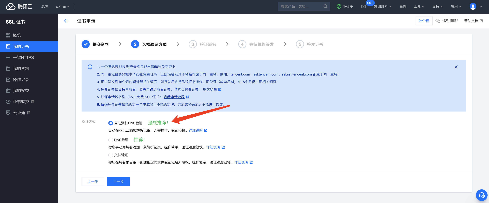
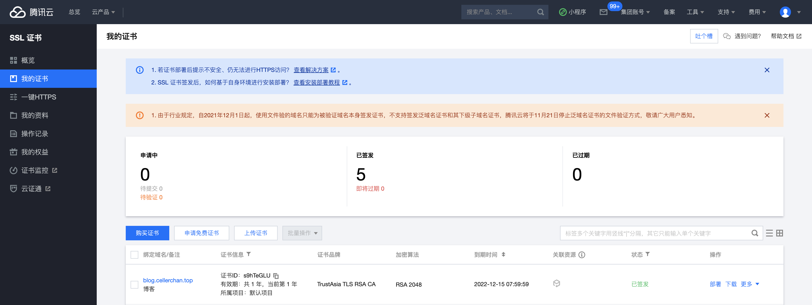

# 如何在同一台服务器上部署前后端分离项目

## 目标

将前后端项目分别部署在同一台服务器上，且均可通过域名访问。

```nginx
worker_processes  1;

events {
	worker_connections  1024;
}

http {
  include       mime.types;
  default_type  application/octet-stream;
  sendfile        on;
  keepalive_timeout  65;

  server {
    listen 443 ssl;
    server_name cellerchan.top; # 监听的域名(服务器已绑定的域名)

    client_max_body_size 5G; # 突破上传大文件
    ssl_certificate /usr/local/nginx/cert/cellerchan.top_bundle.pem; # https 的 pem 文件（crt文件亦可）
    ssl_certificate_key /usr/local/nginx/cert/cellerchan.top.key; # https 的 key 文件

    ssl_session_timeout 5m;
    ssl_ciphers     ECDHE-RSA-AES128-GCM-SHA256:ECDHE:ECDH:AES:HIGH:!NULL:!aNULL!MD5:!ADH:!RC4;
    ssl_protocols TLSv1 TLSv1.1 TLSv1.2;
    ssl_prefer_server_ciphers on;

    location / {
      proxy_pass http://localhost:80; # 本地服务器地址与端口
      proxy_set_header X-Forwarded-For $proxy_add_x_forwarded_for;
      proxy_set_header Host $http_host;
      proxy_set_header X-Forwarded-Proto $scheme;
      proxy_buffering off;
    }
  }

	server {
    listen 443 ssl;
    server_name api.cellerchan.top; # 监听的域名(服务器已绑定的域名)

    client_max_body_size 5G; # 突破上传大文件
    ssl_certificate /usr/local/nginx/cert/api.cellerchan.top_bundle.pem; # https 的 pem 文件（crt文件亦可）
    ssl_certificate_key /usr/local/nginx/cert/api.cellerchan.top.key; # https 的 key 文件

    ssl_session_timeout 5m;
    ssl_ciphers     ECDHE-RSA-AES128-GCM-SHA256:ECDHE:ECDH:AES:HIGH:!NULL:!aNULL!MD5:!ADH:!RC4;
    ssl_protocols TLSv1 TLSv1.1 TLSv1.2;
    ssl_prefer_server_ciphers on;

    location / {
      proxy_pass http://localhost:3000; # 本地服务器地址与端口
      proxy_set_header X-Forwarded-For $proxy_add_x_forwarded_for;
      proxy_set_header Host $http_host;
      proxy_set_header X-Forwarded-Proto $scheme;
      proxy_buffering off;
    }
  }

  server {
    listen       80;
    server_name  api.cellerchan.top;
    location / {
      root   /applications/servers;
      index  index.html index.htm;
      proxy_pass  http://127.0.0.1:3000;
    }
    error_page   500 502 503 504  /50x.html;
      location = /50x.html {
      root   html;
    }
  }

  server {
    listen              80;
    server_name         cellerchan.top;
    location / {
      root   /my-applications/frontend;
      index  index.html index.htm;
    }
  }
}
```

这样一来，我们将前端应用部署到 /my-applications/frontend 下，后端服务启动为3000端口即可通过 cellerchan.top 访问前端页面，通过 api.cellerchan.top 访问后端服务。

## 资源准备

### 购买域名及备案

### 购买服务器

## 环境搭建

### 安装 Nginx

### 安装 Node.js

### 配置 Nginx

### 部署 SSL 证书

#### 1. 申请免费证书

进入 [腾讯云控制台 - SSL 证书管理界面](https://console.cloud.tencent.com/ssl)，会看到如下界面：


点击 申请免费证书 按钮，进入下一步：


填写你申请的证书所要绑定的域名、申请邮箱、私钥密码等，进入下一步：



选择自动添加 DNS 验证，进入下一步：


然后点击左侧菜单回到 我的证书 页面：


可以看到下方已经有一条记录，状态为待验证，稍等片刻，会变成 等待签发 的状态：


再稍等片刻变成 已签发：



然后点击右侧的下载，选择 Nginx 栏的下载：


会下载一个名为 域名_nginx.zip 的压缩包：


等待下载完成。


#### 解析域名

进入 [腾讯云控制台-域名管理-我的域名](https://console.cloud.tencent.com/domain)，看到如下界面，点击解析：


进入 DNSPOD 控制台，点击添加记录：


主机记录填域名前缀，如 blog.cellerchan.top，则填写 blog，记录值填写服务器公网地址，其他选项使用默认值即可，点击确认，就可以通过 http://blog.cellerchan.top 来访问服务器了。


#### 设置 SSL 证书

第一步，登录服务器：

```bash
ssh -q -l root -p 22 101.33.213.134 
```

第二步，上传文件到服务器：

```bash
scp blog.cellerchan.top_nginx/blog.cellerchan.top.key root@101.33.213.134:/usr/local/nginx/cert/
```

第三步，添加 nginx 配置，`vim nginx/conf/nginx.conf`：

添加如下内容，实现 https://blog.cellerchan.top 访问。

```
server {
    listen 443 ssl;
    server_name blog.cellerchan.top; # 监听的域名(服务器已绑定的域名)

    client_max_body_size 5G; # 突破上传大文件
    ssl_certificate /usr/local/nginx/cert/cellerchan.top_bundle.pem; # https 的 pem 文件（crt文件亦可）
    ssl_certificate_key /usr/local/nginx/cert/cellerchan.top.key; # https 的 key 文件

    ssl_session_timeout 5m;
    ssl_ciphers     ECDHE-RSA-AES128-GCM-SHA256:ECDHE:ECDH:AES:HIGH:!NULL:!aNULL!MD5:!ADH:!RC4;
    ssl_protocols TLSv1 TLSv1.1 TLSv1.2;
    ssl_prefer_server_ciphers on;

    location / {
      proxy_pass http://localhost:80; # 本地服务器地址与端口
      proxy_set_header X-Forwarded-For $proxy_add_x_forwarded_for;
      proxy_set_header Host $http_host;
      proxy_set_header X-Forwarded-Proto $scheme;
      proxy_buffering off;
    }
  }
```


