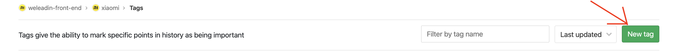

# Gitlab协作开发流程

## Git Commit规范

`<type>(scope): <subject>`

type: 此次commit的类型, 建议使用以下几种类型：

|type|说明|
|---|---|
|fix         |   修复bug
|feat        |   新功能
|update      |   非fix和feat的其他更新
|refactor    |   重构
|docs        |   更新文档（如readme）
|chore       |   构建工具或辅助工具的变动
|style       |   不涉及代码逻辑的变动，如缩进和换行处理
|test        |   添加调试代码

scope: 表示此次提交影响的范围可选参数, 如文档更新、工具类的方法更新则指定相应文件名, 影响全局的更新则使用 * 或不写。

合法的git commit示例：

```bash
# 更新readme
docs(changelog): 添加v4.8.0.0版本记录
# 新增流量池
feat(*): 新增流量池功能
```

## 开发协作规范

当要开始开发一个新功能或进行线上紧急问题修复时，应该遵循以下规范：

### 新建分支

新建分支时，应该基于master分支新建，一个规范完整的分支名应该包含3个部分：

- 分支类型, 取 `git commit规范` 中的推荐值;
- 功能模块名称, 如流量池, 则命名为 `flowpool`
- 开发者gitlab账户名, 如 lexmin0412

综合以上规范，当我们即将开始一个名为流量池的新功能开发时, 我们应该从master新建一个名为 `feat_flowpool_lexmin0412` 的分支。

其他合法的分支名包括但不限于以下类型：

```bash
# 名为流量池的新功能开发, 开发者名称为lexmin0412
feat_flowpool_lexmin0412
# 红包支付紧急问题处理, 开发者名为cathe
fix_redPacket_pay_cathe
# taro依赖版本升级, 开发者名为hehs
chore_taro_update_hehs
```

### 代码合并

当我们进行代码合并时，需要遵循如下规范：

为了实时共享自己到开发进度给别的小伙伴，在合并代码时应该先从自己的分支合并到 `release/develop` 分支, 如果需要在测试环境预览或功能已开发完成, 则再将 `release` 分支的代码合并到 `uat`

为了共享他人的开发进度, 我们也应该在合适的时间从 `release` 分支合并代码到自己的分支。但存在以下特殊情况：

如果存在同一项目有不同的开发者在开发不同的功能,  且不在同一时间上线的情况，切记不能从 `release` 拉取代码到自己的分支, 否则多次合并后会造成开发进度混淆的情况。

### 代码上线

一般来说, 代码在`uat` 测试通过后, 应该从 `release/develop` 分支合并代码到 `master`, 但如果存在同一项目有不同的开发者在开发不同的功能,  且不在同一时间上线的情况，在上线时应该直接从自己的分支合并到 `master` 分支, 然后发送统一格式到邮件给运维小伙伴帮忙上线。

### 上线之后的工作

在运维执行上线之后, 需要视情况执行以下操作。

#### 新建Tag

如果是大版本更新, 在上线之后需要打标签(也就是Tag)来备份我们的代码, 防止丢失。

点击Tags


点击New Tag



进入新建标签的页面, 依照 [Tag规范](./Gitlab_Tag创建规范.md) 填入信息，参考如下：


然后点击 `Create tag` 按钮即可创建标签, 备份当前版本代码, 便于代码回溯。