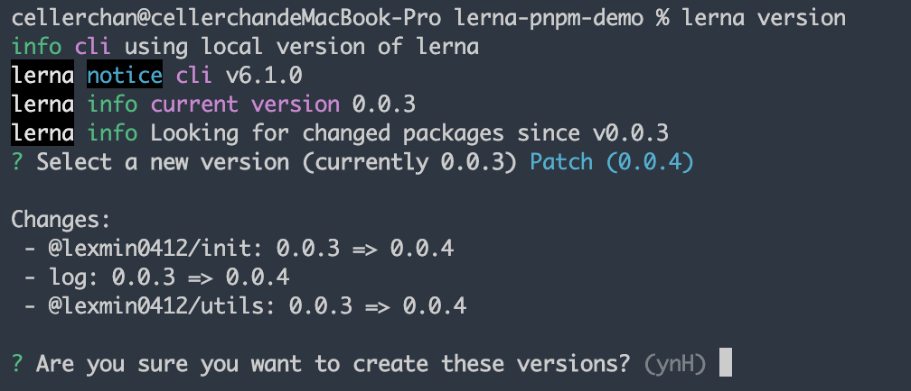
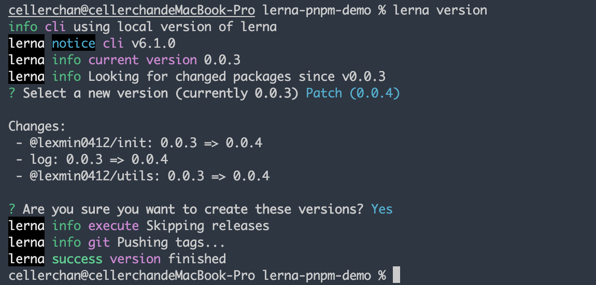
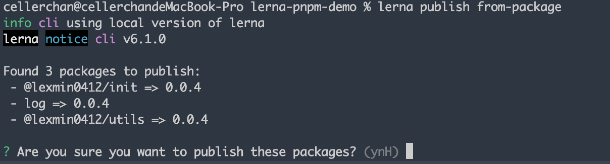

# Lerna 管理 Monorepo 实践

## 1. 初始化项目

Lerna 工作流需要依赖 git 及 npm，所以我们需要先进行如下操作：

```bash
# 创建目录
mkdir lerna-monorepo-demo
cd lerna-monorepo-demo

# 初始化git
git init
git remote add origin git@github.com:lexmin0412/lerna-monorepo-demo.git

# 初始化npm
npm init -y
```

> 注意：在执行 lerna init 之前需要创建 package.json 文件，否则 lerna 会在当前目录的上层目录进行初始化。

## 2. 初始化 lerna

```bash
lerna init
```

初始化后，将会在当前目录下创建如下文件结构：

```bash
packages # 子包目录
.gitignore # git忽略配置
lerna.json # lerna 配置文件
```

并在 package.json 文件中添加如下内容：

```json
{
  "workspaces": ["packages/*"]
}
```

## 3. 创建子包

通过 `learn create` 命令创建包：

```bash
lerna create core
```

运行此命令将会弹出交互式命令行，依次填入如下内容：

- package name 包名
- version 版本号
- description 描述
- keywords 关键词
- homepage 主页
- licence 证书
- entry point 入口文件路径
- git repository git 仓库地址


然后会让你确认即将生成的 package.json 文件内容，确认后将会在 packages 目录下生成名为 core 的新包。

## 4. 处理内部依赖

packages 目录下的各个包可能会存在相互依赖的情况，我们可以使用 link 命令来连接各个包。

比如 core 包对于 utils 包存在依赖，则首先需要在 core 的 package.json 文件中声明依赖：

```json
{
	"dependencies": {
		"@lexmin0412/utils": "^0.0.1"
	}
}
```

然后在根目录执行 `lerna link`，即可将本地 packages 下的 utils 包 link 到 core 的 node_modules 下，如果发现执行后不生效，则在 lerna link 后添加 `--force-local 参数即可`。


## 5. 发布版本

### 5.1 确认版本

先将所有改动提交到 git，然后在根目录执行 lerna version，将会弹出交互式命令行让你选择版本：

> 如果是在 CI 中执行，可以使用 `lerna version <version> --yes` 执行版本，其中的 version 参数为指定的版本，`--yes` 后缀用来跳过后面的确认步骤。`


选择你想要的版本后，Lerna 会列出所有的包版本变化情况：



确认后将会将对应的改动提交到 git 仓库：



### 5.2 发布版本

确认所有子包的 npm 发布配置：

```json
{
	"publishConfig": {
		"access": "public",
		"registry": "https://registry.npmjs.org/"
	}
}
```

执行 `lerna publish` 将会将包发布到 npm，默认将会同上次的 git 提交来进行对比。可以使用 `lerna publish from-package` 来与上次的 npm 发布来对比，同样地，使用 `--yes` 参数可以跳过后面的确认步骤。



## 6. 与 PNPM 集成

lerna 默认使用 npm workspace 管理，如果需要使用 pnpm，则需要做如下改造：

6.1 删除根目录下的 node_modules，并使用 lerna clean 删除所有 pacakge 下面的 node_modules.

6.2 在 lerna.json 中添加如下内容：

```json
{
	"npmClient": "pnpm",
	"useWorkspaces": true
}
```

6.3 创建 pnpm-workspace.yaml 文件，并添加以下内容：

```yaml
packages:
  - "packages/*"
```

6.4 使用 `pnpm import` 命令将其他包管理器的依赖锁定文件如 `package-lock.json`、`yarn.lock` 转换为 `pnpm-lock.yaml`，然后将之前的锁文件删除，再运行 pnpm install 更新依赖即可。

## 7. 与 CI workflow 集成

在 CI 中，我们可以使用 lerna 的 --yes 参数来跳过所有的交互式命令行询问。

下面是一个经过验证的 CI 脚本。

```bash
npm install lerna -g
lerna bootstrap # 如果是 pnpm 则使用 pnpm install
lerna version patch --yes
lerna publish from-package --yes
```

## 参考资料

- [Lerna 官方文档](https://lerna.js.org/)
- [Lerna 使用教程 -- 开发脚手架的流程和核心命令详解](https://blog.csdn.net/weixin_41192489/article/details/125298121)
