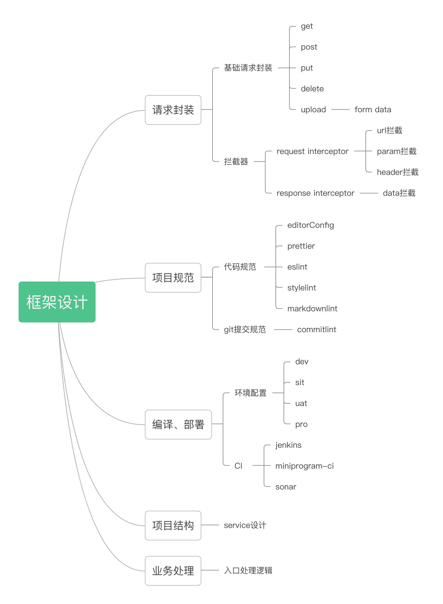

# 基于Taro+TypeScript的多端项目搭建

## 前言

> 此文写于 Taro3 发布稳定版本之前，故所有内容均基于 Taro2.x 版本。

在公司项目中，尤其是依靠微信生态的企业级C端项目，需要同时开发小程序+H5应用的需求非常常见，而综合用户体验、开发效率、维护成本几个关键点之后，选择了Taro作为多端开发的基础框架。选择Taro的理由：

- 跨端，支持 微信/支付宝/百度/字节跳动/京东小程序、h5、React Native
- 类React语法
- 官方积极维护，文档完善，问题处理快

跨端支持不用多说，类 React 语法对于喜欢 React 多过 Vue 的同学也是福音，最重要的在于最后一点，uni-app无疑是当今最受欢迎的多端框架，即便不是专业的前端开发，也能在闲聊时说上两句，但其官方网站充斥的各种广告、居高临下的行文风格，以及官方QQ交流群只见问题不见回复等等，让笔者完全无法对其产生更多的好感。但从根本上来说，Taro和 UniApp都是优秀的跨端框架，选择了 Taro 更多的是由于个人喜好。

## 架构设计

针对于不同的项目定位，它所需要的展现形式以及拥有的能力都不尽相同。那么对于一个跨端框架模版来说，它到底需要哪些能力？

- 针对不同项目阶段的环境配置及编译
- 合理的项目架构，如service、store的设计
- 代码规范
  - git commit log规范
  - 代码书写规范
- 请求能力的封装
  - request基础方法的封装，如get/post/put/delete等
  - 拦截器，如url拦截，header拦截，data拦截等
- 模版文件的交互式一键生成
- 合理的入口页处理逻辑
- 自动化部署



一、项目结构

```bash
├── README.md                      # 项目文档
├── commitlint.config.js           # commitlint配置
├── config                         # 环境配置
│   ├── dev.js                     # 开发环境配置
│   ├── index.js                   # 基础配置
│   ├── local.js                   # 本地配置
│   ├── pro.js                     # 生产环境配置
│   ├── test.js                    # 测试环境配置
│   └── uat.js                     # 预发环境配置
├── generators                     # plop 页面模版生成配置
│   ├── component                  # plop组件模版配置
│   ├── index.js                   # plop配置入口
│   ├── page                       # plop页面模版配置
│   ├── service                    # plop service模版配置
│   └── store                      # plop store模版配置
├── global.d.ts                    # ts全局声明文件
├── package.json                   # 包配置
├── project.config.json            # 小程序配置文件
├── src                            # 业务代码目录
│   ├── app.scss                   # 全局样式
│   ├── app.tsx                    # 项目入口文件
│   ├── components                 # 业务组件存放目录
│   ├── constants                  # 业务常量存放目录
│   ├── enums                      # 业务枚举存放目录
│   ├── index.html                 # h5模版html文件
│   ├── interceptors               # 请求拦截器
│   │   ├── data.interceptor.ts    # response data拦截
│   │   ├── header.interceptor.ts  # request header拦截
│   │   ├── param.interceptor.ts   # request param拦截
│   │   └── url.interceptor.ts     # request url拦截
│   ├── pages                      # 页面存放目录
│   ├── services                   # 后端接口存放目录
│   ├── store                      # 状态管理存放目录
│   │   └── index.ts               # 状态管理入口文件
│   ├── styles                     # 公用样式存放目录
│   │   ├── mixin.scss             # 混入公用样式
│   │   ├── theme.scss             # 主题相关样式
│   │   └── var.scss               # 变量
│   └── utils                      # 业务工具类
```

二、项目规范

三、请求封装

四、业务处理

五、编译及部署（CI）


