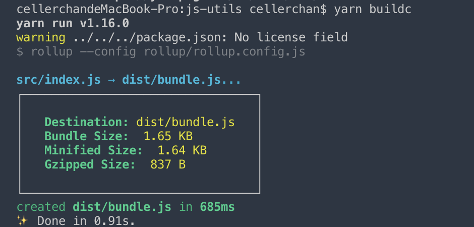

# 使用rollup构建Javascript库

## Why Rollup?

为什么使用Rollup呢？因为Rollup就是为了打包js库而生的，它不包含任何多余的代码，简单小巧，不像webpack打包生成的bundle文件会包含很多webpack相关的代码。

## 参考

- [rollup中文网](https://www.rollupjs.com/guide/tutorial/#%E5%88%9B%E5%BB%BA%E7%AC%AC%E4%B8%80%E4%B8%AAbundlecreating-your-first-bundle)
- [babel中文网-指南](https://www.babeljs.cn/docs/)
- [npm搜索关键字:rollup-plugin](https://www.npmjs.com/search?q=rollup-plugin)

## 安装

```bash
yarn global add rollup
```

## 初始化项目结构

npm初始化

```bash
npm init -y
```

手动创建以下目录

```bash
├── dist                   编译结果目录
├── src                    项目文件目录
├── README.md              项目说明文件
├── .gitignore             git忽略文件
```

在 `.gitignore` 文件中添加如下内容

```bash
node_modules/
dist/
```

以上内容表示在git操作时忽略 `node_modules` 和 `dist` 文件夹下的所有内容

## 新建入口文件

将以下代码粘贴到新建的文件 `src/main.js` 中：

```js
// src/main.js
import foo from './foo.js';
export default function () {
  console.log(foo);
}
```

然后创建入口文件引用的 `foo` 模块

```js
// src/foo.js
export default 'hello world!';
```

## 打包

```bash
rollup src/main.js --output.file dist/bundle.js --output.format cjs
```

## 指定配置文件

创建配置文件 `rollup.config.js` 并增加如下代码

```js
// rollup.config.js
export default {
  input: 'src/main.js',
  output: {
    file: 'bundle.js',
    format: 'cjs'
  }
};
```

指定文件打包

```bash
rollup --config rollup.config.js  # 指定使用根目录下的rollup.config.js中的配置打包
```

## 指定项目引用入口

需要指定打包生成的文件为引用项目入口, 否则在引用此js库时无法正确引用其中的内容。

```json
// package.json
{
  "main": "dist/bundle.js",
}
```

## 引入babel

> 注：以下所有操作均基于 `babel7`

安装依赖

```bash
$yarn add @babel/core -D  # 引入babel核心库
$yarn add @babel/preset-env -D  # ES next语法支持
$yarn add rollup-plugin-babel -D     # rollup babel插件
$yarn add rollup-plugin-node-resolve -D    # rollup无法识别node_modules中的包，使用此插件添加支持
$yarn add rollup-plugin-commonjs -D    # Convert CommonJS modules to ES6, so they can be included in a Rollup bundle 转换commonjs模块为ES6模块, 使它能够被rollup识别 需要与rollup-plugin-node-resolve一起使用
```

安装完成之后的 `package.json` 中依赖如下：

```json
{
  "devDependencies": {
    "@babel/core": "^7.5.5",
    "@babel/preset-env": "^7.5.5",
    "rollup-plugin-babel": "^4.3.3",
    "rollup-plugin-node-resolve": "^5.2.0",
    "rollup-plugin-commonjs": "^10.1.0",
  }
}
```

新建 `.babelrc` 并添加如下代码：

```js
//  .babelrc
{
  "presets": [
    [
      "@babel/preset-env",
      {
        "useBuiltIns": "entry"
      }
    ]
  ]
}
```

在 `rollup.config.js` 中添加如下代码

```js
// rollup.config.js
import babel from 'rollup-plugin-babel';
import commonjs from 'rollup-plugin-commonjs'
import resolve from 'rollup-plugin-node-resolve';

export default {
  plugins:[
    resolve(),  // 解析node模块(rollup默认不支持)
    commonjs({  // rollup-plugin-node-resolve 插件可以解决 ES6模块的查找导入，但是npm中的大多数包都是以CommonJS模块的形式出现的，所以需要使用这个插件将CommonJS模块转换为 ES2015 供 Rollup 处理
      include: 'node_modules/**', // 包括
      exclude: [],  // 排除
    }),
    babel({  // 运行babel配置
      exclude: '**/node_modules/**'   // 不打包node_modules中的文件
    }),
  ],
}
```

此时经过rollup打包之后的 `bundle.js` 就已经将 `ES Next` 的语法转换成 `ES5` 语法了。

到此为止，我们已经可以完成一个js工具类库的全部开发了，如果要进行其他更多操作，请查看下面的内容。

## 其他插件(可选)

### TypeScript支持: [rollup-plugin-typescript](http://npm.taobao.org/package/rollup-plugin-typescript)

安装依赖

```bash
# rollup-plugin-typescript需要依赖typescript和tslib, 所以也要一并安装这两个包
$yarn add typescript tslib rollup-plugin-typescript -D
```

在 `rollup.config.js` 中添加如下内容：

```js
import typescript from 'rollup-plugin-typescript';

export default {
  input: 'src/index.ts',   // 修改入口文件后缀为ts
  plugins:[
    typescript(),  // typescript支持
  ],
}
```

然后我们就可以在项目中愉快的使用 `TypeScript` 了。

### 语法提示

在项目中引入js库之后，如果没有语法提示，使用体验将会非常差。为此，我们需要声明 `d.ts` 文件让我们的js库支持语法提示。

可以使用微软的 `dts-gen` 库来一键生成 `d.ts` 文件

```bash
# 全局安装 dts-gen
yarn global add dts-gen
# 全局安装我们的js库  这里的coordinate-transfer是我们开发的js库的名称
yarn global add coordinate-transfer
# 执行命令生成d.ts文件
dts-gen -m coordinate-transfer
```

执行以上命令会在执行的目录下生成一个与指定js库同名的 `d.ts` 文件,

最后一步, 需要声明 `package.json` 文件中的 `typings` 属性指向生成的文件，如文件路径为根文件夹下的 `types/index.d.ts`, 则进行如下设置：

```json
// package.json
{
  "typings": "types/index.d.ts",
}
```

### 压缩

安装插件

```bash
$yarn add rollup-plugin-uglify -D
```

在 `rollup.config.js` 中添加如下内容

```js
import { uglify } from "rollup-plugin-uglify";

export default {
  plugins:[
    uglify()
  ],
}
```

再次执行打包，此时的 `bundle.js` 就被压缩了

### 打包后展示文件大小

安装插件

```shell
yarn add rollup-plugin-filesize
```

在 `rollup.config.js` 中添加如下内容

```js
import filesize from 'rollup-plugin-filesize';

export default {
  plugins:[
    filesize()
  ],
}
```

再次执行打包, 打包结果输出比正常打包多出了方框内的内容，可以看到输出文件的大小


## 发布至npm

更改package.json

```json
{
  "main": "src/index.js",  // 入口文件
  "module": "src/index.js",  // import引用指向
}
```

```bash
npm version <version>  # 指定版本号
npm login   # 登录npm
npm publish  # npm发布
```

## 在项目中使用

```js
import utils from 'js-utils'
console.log(utils)
```
